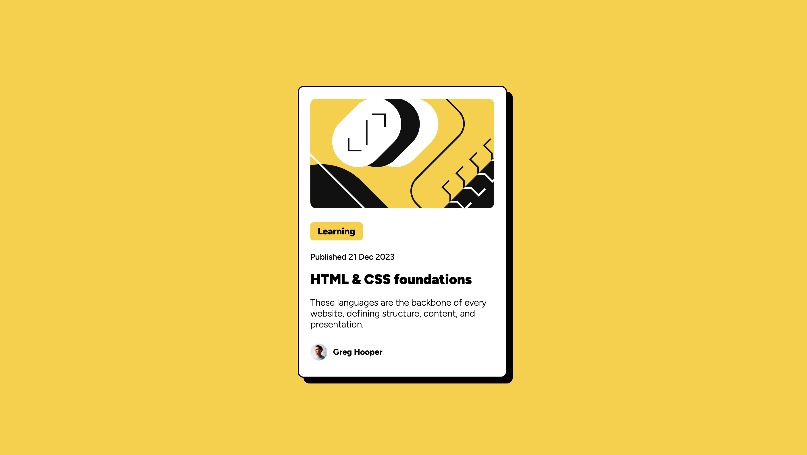

# Frontend Mentor's Blog Preview Card Assignment
## Overview
This repository presents my attempt to solve the [Frontend Mentors' Challenge called **Blog Preview Card**](https://www.frontendmentor.io/challenges/blog-preview-card-ckPaj01IcS).  The project only calls for HTML and CSS, making it a beginner-level project.  That said, I am interested in completing the project to improve my CSS abilities.
## Built With
* HTML
* CSS
## Challenges
For this page, I used Flexbox, instead of CSS Grid.  Since I'm still learning Flexbox, I initially struggled to place the preview card in the center of the page.  

I also made some compromises in my use of semantic HTML, which initially used semantic elements like <figure> and <figcaption>.  However, since the browser often included certain built-in style choices for these elements, I found myself reverting back to 
 elements and using classes to avoid having to override the defaults of these elements.
## Completed Assignments
My attempt to recreate the image provided in the Frontend Mentor's Blog Preview Card challenge has been published [here](https://grimmaldi.github.io/fe-mentors-blog-preview-card/).  Here is a screenshot of the site in its current state:
